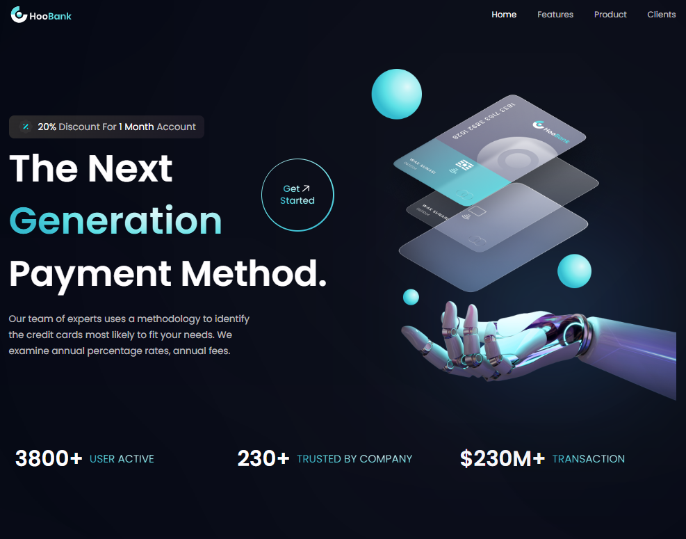
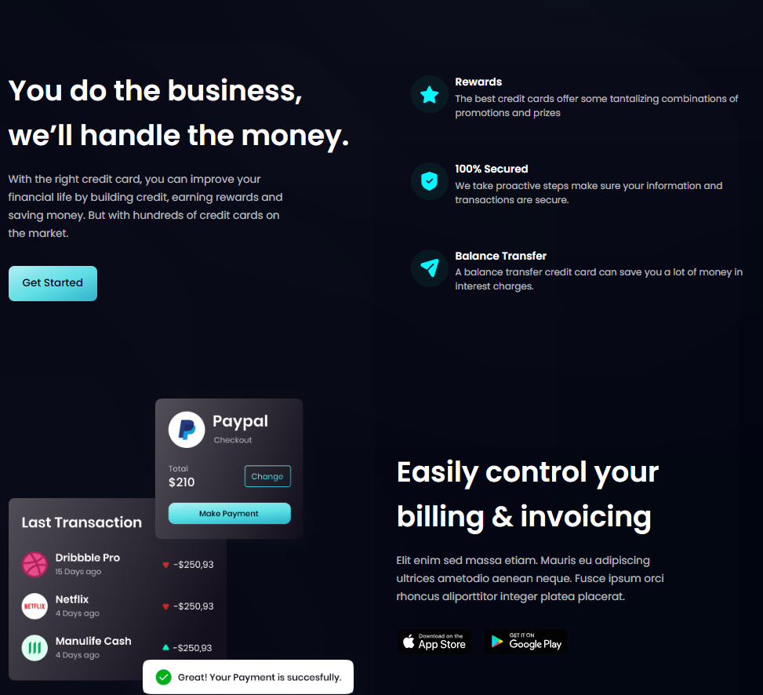
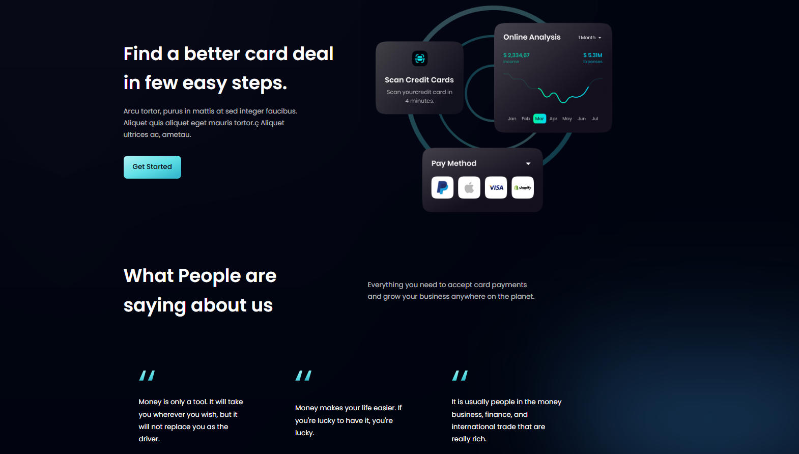
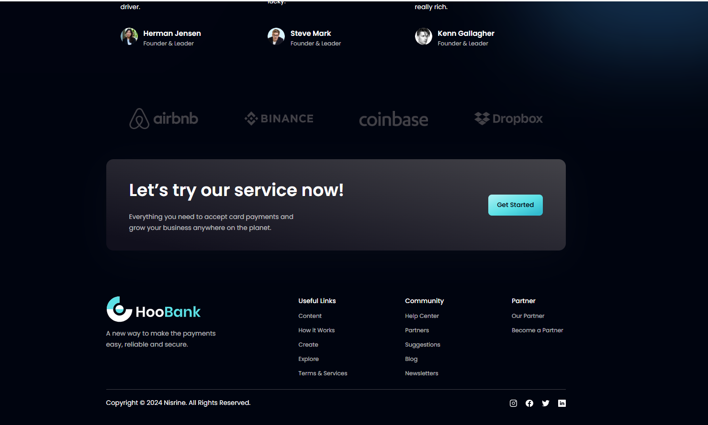
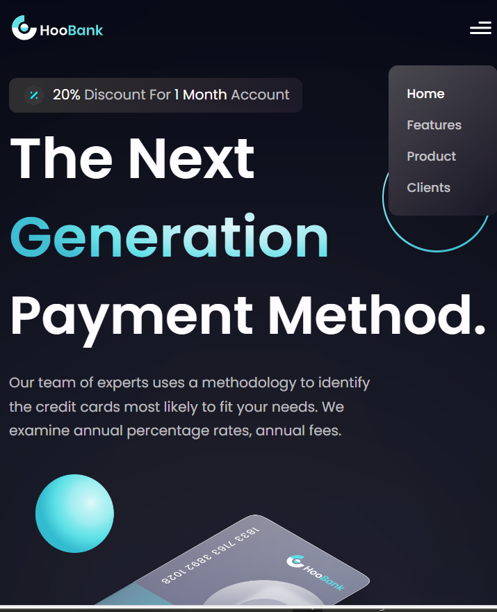

# Bank Service UI/UX Design

## Description

The Bank Service UI/UX Design project is a responsive web application aimed at providing a modern and user-friendly interface for a banking service. Built using React.js and styled with Tailwind CSS, this project focuses on delivering an intuitive user experience while ensuring a visually appealing design that adapts seamlessly to various screen sizes and devices.


## Screenshots/Demo








## Installation

1. Clone the repository:
   ```sh
   git clone https://github.com/your-username/bank-service-ui-ux.git


# React + Vite

This template provides a minimal setup to get React working in Vite with HMR and some ESLint rules.

Currently, two official plugins are available:

- [@vitejs/plugin-react](https://github.com/vitejs/vite-plugin-react/blob/main/packages/plugin-react/README.md) uses [Babel](https://babeljs.io/) for Fast Refresh
- [@vitejs/plugin-react-swc](https://github.com/vitejs/vite-plugin-react-swc) uses [SWC](https://swc.rs/) for Fast Refresh
